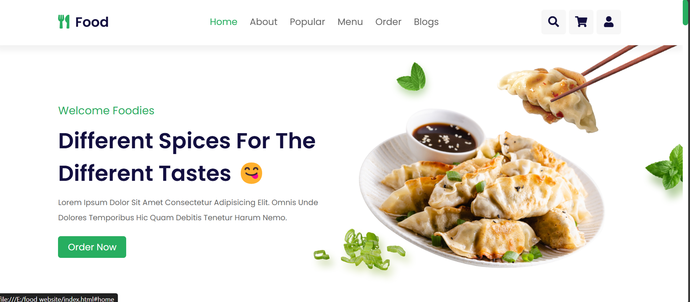
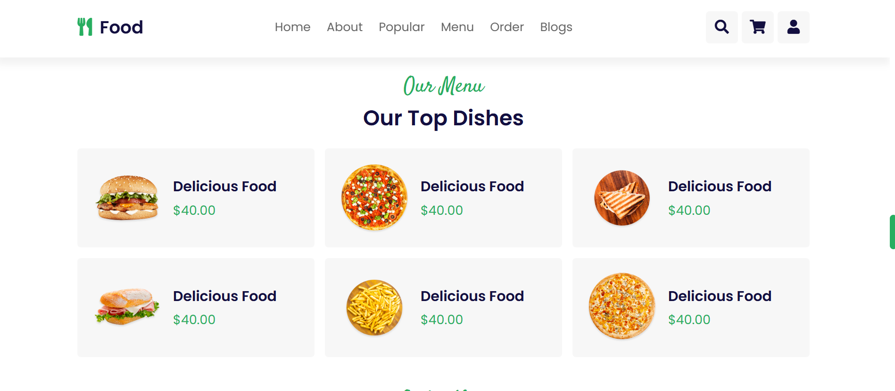
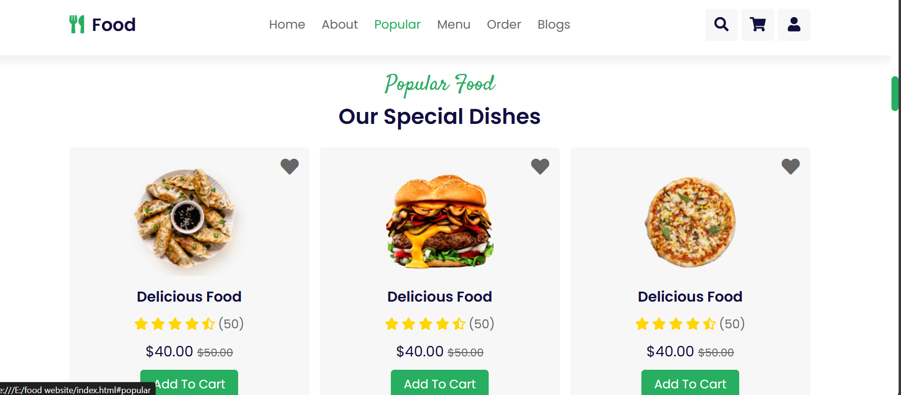

# TastyBites 🍽️

TastyBites is a responsive restaurant website project featuring a dynamic home page, interactive menu, popular dishes, and easy navigation. Built with **HTML5**, **CSS3**, and **Font Awesome**, it showcases your culinary offerings with a modern and functional design.

## 🚀 Features

- **Responsive Design:** 📱 Adapts to all screen sizes and devices for an optimal viewing experience.
- **Interactive UI:** 🌟 Includes a navigation menu, search form, shopping cart, and login form.
- **Dynamic Sections:** 🗂️ Home, About, Popular Dishes, Menu, Order, Blogs, and more.
- **Custom Styling:** 🎨 Unique look and feel with custom CSS and Font Awesome icons.

## 🛠 Technologies Used

- **HTML5**: 🏗️ Provides the structure for web pages.
- **CSS3**: 🎨 Manages the styling and layout.
- **Font Awesome**: 🌐 Adds modern icons for enhanced user experience.
- **Responsive Design Techniques**: 📐 Ensures the site looks great on all devices.

## 🏁 Getting Started

To get a local copy of TastyBites up and running, follow these simple steps:

1. **Clone the repo**:
   ```bash
   git clone https://github.com/yourusername/TastyBites.git


## 🌟Usage


Explore the various sections to see the interactive features. Customize and expand upon this project as you see fit.

## Screenshots

### Home Page


### Menu Page


### Popular Dishes


## Contributing

Contributions are welcome! If you have suggestions for improvements or new features, please open an issue or submit a pull request.

## License

Distributed under the MIT License. See `LICENSE` for more information.

## Acknowledgements

- **Font Awesome** for the icons.
- Inspiration from various online tutorials and resources.
 
